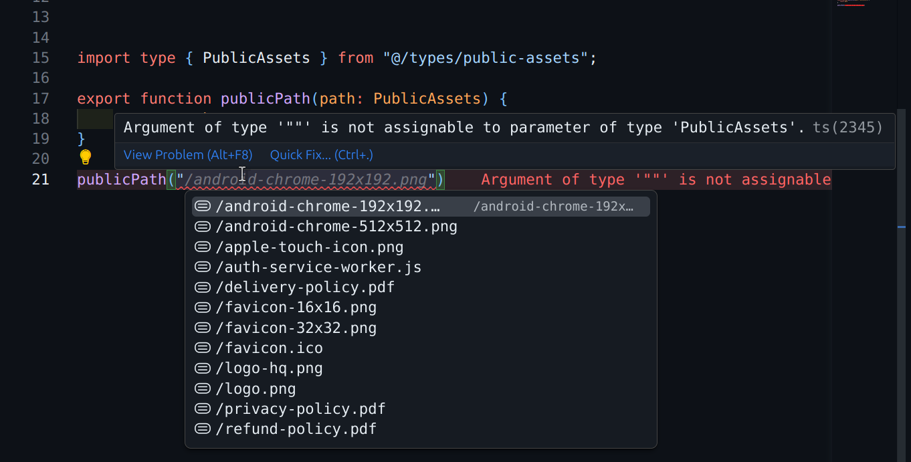

# vite-plugin-public-assets-types

[](https://www.npmjs.com/package/vite-plugin-public-assets-types)
[](LICENSE)

> A Vite plugin that scans your `public` directory and generates a TypeScript union type of all public asset paths.



## Features

- 🔍 Recursively reads all files in your `public` folder.
- 🔧 Generates a `.ts` file exporting a union type of asset paths (e.g. `"/logo.png" | "/manifest.json"`).
- 🛠️ Configurable public directory, output path, and type name.

## Installation

```bash
pnpm add -D vite-plugin-public-assets-types
# or
npm install --save-dev vite-plugin-public-assets-types
# or
yarn add -D vite-plugin-public-assets-types
```

## Usage

In your `vite.config.ts`:

```ts
import { defineConfig } from "vite";
import publicAssetsPlugin from "vite-plugin-public-assets-types";

export default defineConfig({
  plugins: [
    publicAssetsPlugin({
      // options here (optional)
      publicDir: "public",
      output: "src/types/public-assets.ts",
      variableName: "PublicAssets",
    }),
  ],
});
```

After running `vite build` (or `vite dev`), you’ll get a file that looks like:

```ts
// Generated by vite-plugin-public-assets-types. Do not edit.
export type PublicAssets =
  | "/logo.png"
  | "/images/banner.jpg"
  | "/manifest.json";
```

## Options

| Option         | Type     | Default              | Description                                                     |
| -------------- | -------- | -------------------- | --------------------------------------------------------------- |
| `publicDir`    | `string` | `'public'`           | Path to your public assets directory, relative to project root. |
| `output`       | `string` | `'src/generated.ts'` | Path (relative or absolute) for the generated TypeScript file.  |
| `variableName` | `string` | `'PublicAssets'`     | Name of the exported union type.                                |

## Example

```bash
tree .
.
├── public
│   ├── logo.png
│   └── manifest.json
├── src
│   └── generated.ts      # auto-generated
└── vite.config.ts
```

```ts
// src/generated.ts (auto-generated)
// Generated by vite-plugin-public-assets-types. Do not edit.
export type PublicAssets = "/logo.png" | "/manifest.json";
```

## Integrate in Code

You can import and use the type in your code to ensure you only refer to valid assets:

```ts
import type { PublicAssets } from "./generated";

function getAssetUrl(file: PublicAssets) {
  return file;
}

// ✅ valid
getAssetUrl("/logo.png");

// ❌ error: Argument of type '"/unknown.png"' is not assignable to parameter of type 'PublicAssets'.
getAssetUrl("/unknown.png");
```

## License

MIT © [Ahmed Abdelbaset](https://ahmedbaset.dev)
